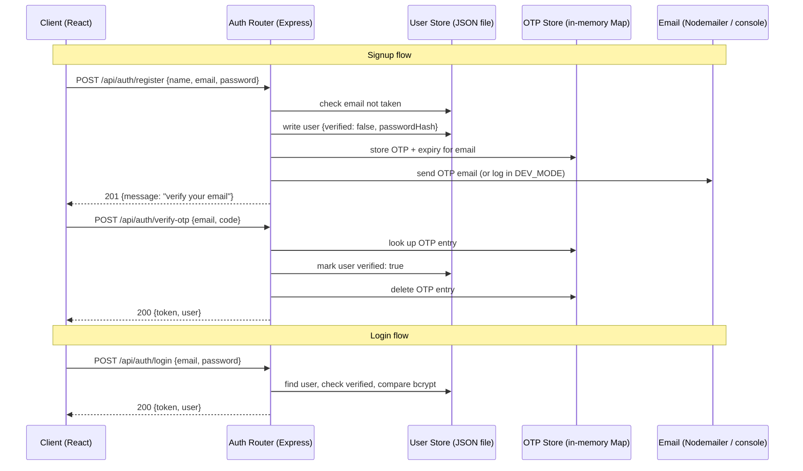

# Design Document: Backend Auth with OTP

## Overview

This design migrates TravelBuddy's authentication from an insecure frontend-only approach (djb2 hashing + localStorage) to a proper backend system. The Express server gains three REST endpoints (`/api/auth/register`, `/api/auth/verify-otp`, `/api/auth/login`) plus a JWT middleware. The React client is updated to call these endpoints and manage the JWT, while the existing `AuthModal` gains an OTP step between signup and login.

Key constraints from the agreed decisions:
- User records persist in a JSON file (easy to swap for a real DB later)
- OTP is only required during signup, not login
- `DEV_MODE=true` logs the OTP to the console instead of sending email
- bcrypt cost factor ≥ 10
- JWT expiry: 7 days
- Nodemailer with SMTP env vars for email delivery

---

## Architecture

The system follows a clean client–server split. The client never touches user records directly; all auth logic lives in the server.



### Module layout

```
server/
  server.js              ← existing entry point (add express.json + auth router)
  auth/
    router.js            ← Express router: /register, /verify-otp, /login
    authService.js       ← business logic (register, verifyOtp, login)
    otpService.js        ← OTP generation, storage, expiry
    emailService.js      ← Nodemailer wrapper + DEV_MODE console fallback
    jwtService.js        ← sign / verify JWT helpers
    middleware.js        ← requireAuth middleware
  data/
    userStore.js         ← read/write users.json
    users.json           ← persisted user records (created on first write)

client/src/
  utils/
    auth.js              ← replaced: API call helpers + localStorage/sessionStorage helpers
  components/
    AuthModal.jsx        ← add OTP step state
    SignupForm.jsx       ← call /api/auth/register, hand off to OTP step
    LoginForm.jsx        ← call /api/auth/login
    OtpForm.jsx          ← new: collect 6-digit code, call /api/auth/verify-otp
```

---

## Components and Interfaces

### Server: REST API

All endpoints are mounted at `/api/auth`.

#### `POST /api/auth/register`

Request body:
```json
{ "name": "Alice", "email": "alice@example.com", "password": "hunter42!" }
```

Success response `201`:
```json
{ "message": "Verification code sent to your email." }
```

Error responses:
- `400` — missing fields, invalid email format, password < 8 chars
- `409` — email already registered and verified

#### `POST /api/auth/verify-otp`

Request body:
```json
{ "email": "alice@example.com", "code": "482910" }
```

Success response `200`:
```json
{
  "token": "<jwt>",
  "user": { "id": "uuid", "name": "Alice", "email": "alice@example.com" }
}
```

Error responses:
- `400` — no OTP entry, expired, or wrong code

#### `POST /api/auth/login`

Request body:
```json
{ "email": "alice@example.com", "password": "hunter42!" }
```

Success response `200`:
```json
{
  "token": "<jwt>",
  "user": { "id": "uuid", "name": "Alice", "email": "alice@example.com" }
}
```

Error responses:
- `401` — email not found or wrong password (generic message to prevent enumeration)
- `403` — account exists but email not verified

#### `requireAuth` middleware

Reads `Authorization: Bearer <token>`, verifies the JWT, attaches `req.user = { id, name, email }`, calls `next()`. Returns `401` on any failure.

---

### Server: Internal Modules

#### `authService.js`

```js
register(name, email, password)  → { message }  // throws AppError on validation failure
verifyOtp(email, code)           → { token, user }
login(email, password)           → { token, user }
```

#### `otpService.js`

```js
generateAndStore(email)  → string   // 6-digit code, stored with 10-min expiry
verify(email, code)      → void     // throws AppError if invalid/expired; deletes entry on success
```

Internal store: `Map<email, { code: string, expiresAt: number }>` — lives in process memory, reset on server restart (acceptable for this scope).

#### `emailService.js`

```js
sendOtp(email, code)  → Promise<void>  // sends email or logs to console in DEV_MODE
```

#### `jwtService.js`

```js
sign(payload)    → string   // signs with JWT_SECRET, 7d expiry
verify(token)    → payload  // throws on invalid/expired
```

#### `userStore.js`

```js
findByEmail(email)   → User | undefined
findById(id)         → User | undefined
create(userData)     → User           // assigns uuid, writes to file
update(id, changes)  → User           // merges changes, writes to file
```

User record shape (stored in `users.json`):
```json
{
  "id": "uuid-v4",
  "name": "Alice",
  "email": "alice@example.com",
  "passwordHash": "$2b$10$...",
  "verified": false,
  "createdAt": "2025-01-01T00:00:00.000Z"
}
```

---

### Client: Updated Modules

#### `client/src/utils/auth.js` (replacement)

```js
// API helpers
registerUser(name, email, password)  → Promise<{ message }>
verifyOtp(email, code)               → Promise<{ token, user }>
loginUser(email, password)           → Promise<{ token, user }>

// Session helpers (unchanged interface)
getSession()    → { name, email } | null
setSession(name, email, token)  → void   // also stores tb_token in localStorage
clearSession()  → void                   // removes tb_token + tb_session
isValidEmail(email)  → boolean           // kept for client-side pre-validation
```

#### `OtpForm.jsx` (new component)

Props: `{ email, onSuccess, onBack }`

Renders a 6-digit code input. On submit calls `verifyOtp(email, code)`. On success calls `onSuccess({ name, email })`. Shows a resend link (calls `registerUser` again with the same credentials — not in scope for this iteration; link is present but disabled).

#### `AuthModal.jsx` (updated)

Adds a third internal state `'otp'` alongside `'login'` and `'signup'`. When `SignupForm` succeeds (gets a 201), `AuthModal` transitions to `'otp'` and renders `OtpForm` with the email. The tab bar is hidden during the OTP step.

---

## Data Models

### User record (users.json)

| Field          | Type    | Notes                                      |
|----------------|---------|--------------------------------------------|
| `id`           | string  | UUID v4, assigned at creation              |
| `name`         | string  | Display name, trimmed                      |
| `email`        | string  | Lowercase, unique                          |
| `passwordHash` | string  | bcrypt hash, cost factor ≥ 10              |
| `verified`     | boolean | `false` until OTP confirmed                |
| `createdAt`    | string  | ISO 8601 timestamp                         |

`users.json` is a JSON array of User records. Reads and writes are synchronous (`fs.readFileSync` / `fs.writeFileSync`) — acceptable for this scale; a file lock is not needed since Node.js is single-threaded and requests are handled sequentially within the event loop.

### OTP entry (in-memory)

| Field       | Type   | Notes                          |
|-------------|--------|--------------------------------|
| `code`      | string | 6-digit zero-padded string     |
| `expiresAt` | number | `Date.now() + 10 * 60 * 1000`  |

Keyed by lowercase email in a module-level `Map`.

### JWT payload

```json
{ "id": "uuid", "name": "Alice", "email": "alice@example.com", "iat": 0, "exp": 0 }
```

Signed with `HS256` using `JWT_SECRET` env var. Expiry: `7d`.

### Environment variables

| Variable    | Required | Default | Purpose                              |
|-------------|----------|---------|--------------------------------------|
| `JWT_SECRET`| yes      | —       | JWT signing secret                   |
| `SMTP_HOST` | no*      | —       | SMTP server hostname                 |
| `SMTP_PORT` | no*      | 587     | SMTP port                            |
| `SMTP_USER` | no*      | —       | SMTP username                        |
| `SMTP_PASS` | no*      | —       | SMTP password                        |
| `DEV_MODE`  | no       | false   | If `"true"`, log OTP instead of send |

*Required when `DEV_MODE` is not `"true"`.

---

## Correctness Properties

*A property is a characteristic or behavior that should hold true across all valid executions of a system — essentially, a formal statement about what the system should do. Properties serve as the bridge between human-readable specifications and machine-verifiable correctness guarantees.*

### Property 1: Valid registration produces a stored, unverified user

*For any* valid combination of name, email, and password (name non-empty, email well-formed, password ≥ 8 chars), calling `register` SHALL result in a user record existing in the User_Store with `verified: false`, a bcrypt hash that matches the original password, and a 6-digit OTP entry in the OTP_Store with an expiry approximately 10 minutes in the future.

**Validates: Requirements 1.1, 1.5, 1.6**

---

### Property 2: Duplicate email is rejected

*For any* email address that is already associated with a verified user record, a subsequent `register` call with that email SHALL return a 409 error and SHALL NOT create a second user record or overwrite the existing one.

**Validates: Requirements 1.4**

---

### Property 3: Invalid registration inputs are rejected

*For any* registration request where at least one field is missing, the email is malformed, or the password is shorter than 8 characters, `register` SHALL return a 400 error and SHALL NOT write any record to the User_Store.

**Validates: Requirements 1.1, 1.2, 1.3**

---

### Property 4: Correct OTP verifies and issues a JWT

*For any* email that has a pending OTP entry, submitting the correct code before expiry SHALL mark the user as `verified: true`, remove the OTP entry from the OTP_Store, and return a JWT whose decoded payload contains the user's id, name, and email.

**Validates: Requirements 2.1, 2.5, 2.6**

---

### Property 5: Expired or wrong OTP is rejected

*For any* OTP entry, submitting a code after the expiry timestamp, or submitting any code that does not exactly match the stored code, SHALL return a 400 error and SHALL NOT mark the user as verified.

**Validates: Requirements 2.2, 2.3, 2.4**

---

### Property 6: JWT round-trip preserves payload

*For any* user payload `{ id, name, email }`, signing it with `jwtService.sign` and then verifying with `jwtService.verify` SHALL produce an object with identical `id`, `name`, and `email` fields.

**Validates: Requirements 2.6, 3.6**

---

### Property 7: Login with correct credentials returns a matching JWT

*For any* verified user record, calling `login` with the correct email and password SHALL return a JWT whose decoded payload contains the user's id, name, and email.

**Validates: Requirements 3.1, 3.4, 3.6**

---

### Property 8: Login rejects all invalid attempts

*For any* login attempt where the email does not exist in the User_Store, the password does not match the stored bcrypt hash, or the user record has `verified: false`, `login` SHALL return an error (401 or 403 as appropriate) and SHALL NOT return a JWT.

**Validates: Requirements 3.2, 3.3, 3.5**

---

### Property 9: requireAuth passes valid tokens and rejects all others

*For any* JWT produced by `jwtService.sign`, the `requireAuth` middleware SHALL attach the decoded payload to `req.user` and call `next()`. *For any* request with a missing Authorization header, a non-Bearer Authorization header, an expired token, a token with an invalid signature, or a malformed token string, the middleware SHALL return a 401 error.

**Validates: Requirements 4.1, 4.2, 4.3, 4.4**

---

### Property 10: Client session storage round-trip

*For any* token string and user object `{ name, email }`, calling `setSession` SHALL store the token in `localStorage` under `tb_token` and the user in `sessionStorage` under `tb_session`. Calling `clearSession` SHALL remove both keys regardless of what was previously stored.

**Validates: Requirements 5.5, 5.6**

---

### Property 11: OTP email contains the code

*For any* 6-digit OTP code, calling `emailService.sendOtp` SHALL result in the email body (or console output in DEV_MODE) containing that exact code.

**Validates: Requirements 6.1, 6.4**

---

## Error Handling

### Server-side

All route handlers are wrapped in a shared `asyncHandler` utility that catches thrown errors and forwards them to an Express error-handling middleware. A custom `AppError` class carries an HTTP status code and message:

```js
class AppError extends Error {
  constructor(message, statusCode) {
    super(message);
    this.statusCode = statusCode;
  }
}
```

The error middleware returns:
```json
{ "error": "<message>" }
```

Specific error scenarios:

| Scenario                          | Status | Message                                |
|-----------------------------------|--------|----------------------------------------|
| Missing required fields           | 400    | "Name, email, and password are required." |
| Invalid email format              | 400    | "Invalid email address."               |
| Password too short                | 400    | "Password must be at least 8 characters." |
| Email already registered          | 409    | "An account with this email already exists." |
| OTP not found / already used      | 400    | "Invalid or expired verification code." |
| OTP expired                       | 400    | "Verification code has expired."       |
| OTP wrong code                    | 400    | "Incorrect verification code."         |
| Email not found (login)           | 401    | "Invalid credentials."                 |
| Account not verified (login)      | 403    | "Please verify your email before logging in." |
| Wrong password (login)            | 401    | "Invalid credentials."                 |
| Missing/invalid JWT               | 401    | "Authentication required."             |
| SMTP failure                      | 500    | "Failed to send verification email."   |

Note: login errors for "not found" and "wrong password" use the same generic message to prevent email enumeration.

### Client-side

Each API helper in `auth.js` throws an `Error` with the server's `error` field as the message. Form components catch this in a `try/catch` and display it via the existing `error` state variable. No changes to the existing error display UI are needed.

---

## Testing Strategy

### Unit tests (Vitest on the server)

Focus on pure logic and isolated modules:

- `authService`: registration validation, duplicate detection, OTP trigger
- `otpService`: code generation format (6 digits), expiry logic, correct/wrong/expired code handling
- `jwtService`: sign → verify round-trip, expired token rejection, tampered token rejection
- `userStore`: create, findByEmail, update (using a temp file path to avoid touching real data)
- `emailService`: DEV_MODE logs to console instead of calling Nodemailer transport

### Property-based tests (fast-check, server)

Each property from the Correctness Properties section maps to one property-based test. Minimum 100 iterations per test.

Tag format: `// Feature: backend-auth-otp, Property N: <property text>`

| Property | Test description |
|----------|-----------------|
| P1  | Generate random valid (name, email, password) tuples → user exists with `verified: false`, bcrypt matches, OTP entry has 6-digit code |
| P2  | Generate a verified user, then attempt re-registration with same email → always 409, user count unchanged |
| P3  | Generate invalid inputs (empty fields, bad email, short password) → always 400, no record written |
| P4  | Generate valid OTP entries → correct code before expiry always verifies, deletes entry, returns JWT |
| P5  | Generate OTP entries with expired timestamps or wrong codes → always 400, user stays unverified |
| P6  | Generate arbitrary `{ id, name, email }` payloads → sign then verify produces identical payload |
| P7  | Generate verified users with known passwords → login always returns JWT with matching payload |
| P8  | Generate login attempts with wrong password, missing user, or unverified account → always error, never JWT |
| P9  | Generate valid JWTs → middleware always passes; generate missing/malformed/expired/wrong-secret tokens → always 401 |
| P10 | Generate random token strings and user objects → setSession stores correctly; clearSession always removes both keys |
| P11 | Generate random 6-digit codes → sendOtp always produces output containing that exact code |

### Integration tests

- Full signup → OTP → login flow against a real (temp) `users.json`
- DEV_MODE OTP delivery (console spy)
- `requireAuth` middleware wired into a test Express app

### Client tests (Vitest + React Testing Library)

- `OtpForm`: renders, submits correct code, shows error on failure
- `SignupForm`: transitions to OTP step on 201 response
- `LoginForm`: stores token and session on success, shows error on 401/403
- `auth.js` helpers: mock `fetch`, verify correct request shape and response handling
