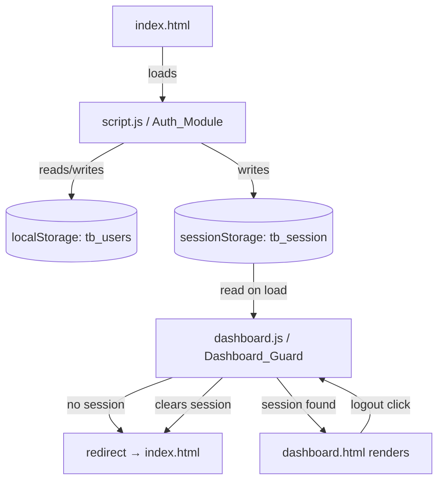

# Design Document: User Authentication

## Overview

This feature wires up real client-side authentication to the existing Travel Buddy Finder modal UI. All logic runs in the browser with no backend — `localStorage` persists registered users and `sessionStorage` holds the active session. The existing HTML forms and modal structure remain unchanged; only JavaScript is added or modified.

Two modules handle all auth concerns:

- **Auth_Module** — lives in `script.js`, handles signup, login, validation, hashing, and session creation.
- **Dashboard_Guard** — lives in `dashboard.js`, handles session checking, redirect-on-no-session, personalization, and logout.

## Architecture



The flow is strictly linear: Auth_Module writes the session, Dashboard_Guard reads it. There is no shared module — each file is self-contained.

## Components and Interfaces

### Auth_Module (`script.js`)

All new auth logic is appended to the existing `script.js` after the current modal/scroll code. The existing `formLogin` and `formSignup` submit handlers are replaced.

**Public surface (functions defined in module scope):**

```
hashPassword(str: string) → string
  Deterministic djb2-style hash. Returns a decimal string.

getUsers() → Array<{name, email, passwordHash}>
  Reads and JSON-parses tb_users from localStorage. Returns [] on missing/corrupt data.

saveUsers(users: Array) → void
  JSON-stringifies and writes to localStorage key tb_users.

getSession() → {name, email} | null
  Reads and JSON-parses tb_session from sessionStorage. Returns null on missing/corrupt data.

setSession(name: string, email: string) → void
  Writes {name, email} to sessionStorage key tb_session.

clearSession() → void
  Removes tb_session from sessionStorage.

showError(form: HTMLFormElement, message: string) → void
  Finds or creates a <p class="auth-error"> beneath the form and sets its textContent.

clearError(form: HTMLFormElement) → void
  Removes any existing <p class="auth-error"> beneath the form.

handleSignup(e: SubmitEvent) → void
  Validates, hashes, stores user, sets session, redirects.

handleLogin(e: SubmitEvent) → void
  Validates, looks up user, verifies hash, sets session, redirects.
```

### Dashboard_Guard (`dashboard.js`)

A small block prepended to the top of `dashboard.js` (before any existing code) that runs immediately on page load.

```
initGuard() → void
  Reads session. Redirects to index.html if null.
  Otherwise calls personalizeUI() and attachLogout().

personalizeUI(session: {name, email}) → void
  Sets .profile-name textContent to session.name.
  Sets .avatar textContent to session.name[0].toUpperCase().

attachLogout() → void
  Attaches click handler to all .logout-link elements and
  the "Logout" <a> inside #profile-dropdown.
  Handler: clearSession() then redirect to index.html.
```

### Error Display

Each auth form gets an inline `<p class="auth-error">` injected beneath it (inside the modal) when a validation or auth error occurs. The element is removed (not just hidden) on the next submission attempt so the DOM stays clean.

## Data Models

### User_Store — `localStorage` key: `tb_users`

```json
[
  {
    "name": "Alice Smith",
    "email": "alice@example.com",
    "passwordHash": "2872194982"
  }
]
```

- Array of plain objects.
- `passwordHash` is the decimal string output of `hashPassword(plainTextPassword)`.
- Email is stored lowercase-trimmed to ensure case-insensitive lookup.

### Session_Store — `sessionStorage` key: `tb_session`

```json
{
  "name": "Alice Smith",
  "email": "alice@example.com"
}
```

- Written on successful signup or login.
- Removed on logout.
- `sessionStorage` is automatically cleared when the browser tab is closed.

### Password Hash Algorithm

djb2-style 32-bit hash, returned as an unsigned decimal string:

```js
function hashPassword(str) {
  let hash = 5381;
  for (let i = 0; i < str.length; i++) {
    hash = ((hash << 5) + hash) ^ str.charCodeAt(i);
    hash = hash >>> 0; // keep unsigned 32-bit
  }
  return String(hash);
}
```

- Deterministic: same input always produces same output.
- No external dependencies.
- Not cryptographically secure — appropriate for a client-side demo with no backend.

## Correctness Properties

*A property is a characteristic or behavior that should hold true across all valid executions of a system — essentially, a formal statement about what the system should do. Properties serve as the bridge between human-readable specifications and machine-verifiable correctness guarantees.*

### Property 1: Hash determinism

*For any* plain-text password string, calling `hashPassword` twice on the same input SHALL return the same value both times.

**Validates: Requirements 7.1, 7.4**

---

### Property 2: Signup stores hashed password, not plain text

*For any* valid signup (unique email, name present, password ≥ 8 chars), after `handleSignup` completes the User_Store SHALL contain exactly one entry whose `passwordHash` equals `hashPassword(password)` and whose `passwordHash` does NOT equal the plain-text password.

**Validates: Requirements 1.6, 7.2**

---

### Property 3: Login verification uses hash comparison

*For any* registered user, submitting the correct plain-text password to `handleLogin` SHALL succeed (session created), and submitting any string whose `hashPassword` differs from the stored hash SHALL fail (no session created, error shown).

**Validates: Requirements 2.5, 2.6, 7.3**

---

### Property 4: Signup rejects duplicate emails

*For any* email already present in the User_Store, a subsequent signup attempt with the same email (regardless of name or password) SHALL not add a second entry to the User_Store and SHALL display the duplicate-email error message.

**Validates: Requirements 1.4, 1.5**

---

### Property 5: Whitespace/invalid inputs are rejected

*For any* signup submission where name is empty, email is malformed, or password is fewer than 8 characters, `handleSignup` SHALL not write to the User_Store and SHALL display the appropriate Error_Message.

**Validates: Requirements 1.1, 1.2, 1.3, 3.3, 3.4, 3.5**

---

### Property 6: Session round-trip

*For any* successful login or signup, the name and email written to Session_Store by `setSession` SHALL be exactly retrievable by `getSession` without mutation.

**Validates: Requirements 1.7, 2.6**

## Error Handling

| Scenario | Behavior |
|---|---|
| `localStorage` unavailable (private browsing) | `getUsers`/`saveUsers` wrapped in try/catch; falls back to empty array; signup still proceeds in-memory for the session |
| `sessionStorage` unavailable | `getSession` returns null; Dashboard_Guard redirects to index.html |
| Corrupt JSON in `tb_users` | `getUsers` catches parse error, returns `[]` |
| Corrupt JSON in `tb_session` | `getSession` catches parse error, returns `null` |
| Empty User_Store on login | Treated as "no account found" — shows correct error message |

## Testing Strategy

This feature is pure JavaScript logic with no build tools, so tests are written as plain JS assertions runnable in the browser console or a minimal test harness.

**Unit tests** cover specific examples and edge cases:
- `hashPassword` returns a string for empty input, ASCII input, and Unicode input.
- `getUsers` returns `[]` when `tb_users` is absent or corrupt.
- `getSession` returns `null` when `tb_session` is absent or corrupt.
- `showError` injects a `<p class="auth-error">` beneath the form.
- `clearError` removes the element if present, is a no-op if absent.
- Login with wrong password shows "Incorrect password."
- Login with unknown email shows "No account found with this email."
- Signup with duplicate email shows "An account with this email already exists."

**Property-based tests** validate universal correctness properties (Properties 1–6 above). Since there is no npm, a minimal inline property runner is used:

```js
// Minimal property runner (no dependencies)
function property(label, gen, predicate, iterations = 100) {
  for (let i = 0; i < iterations; i++) {
    const input = gen();
    if (!predicate(input)) {
      console.error(`FAIL [${label}] counterexample:`, input);
      return false;
    }
  }
  console.log(`PASS [${label}] (${iterations} iterations)`);
  return true;
}
```

Each property test is tagged with its design property number:
- **Feature: user-authentication, Property 1**: Hash determinism
- **Feature: user-authentication, Property 2**: Signup stores hash not plain text
- **Feature: user-authentication, Property 3**: Login verification uses hash comparison
- **Feature: user-authentication, Property 4**: Signup rejects duplicate emails
- **Feature: user-authentication, Property 5**: Whitespace/invalid inputs rejected
- **Feature: user-authentication, Property 6**: Session round-trip

Minimum 100 iterations per property test.
